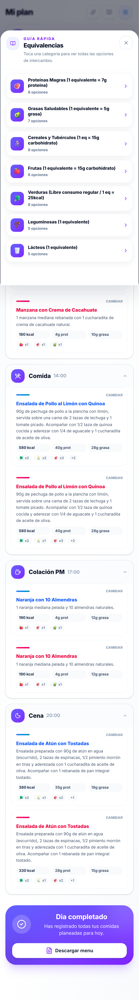
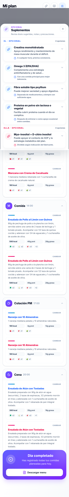

# Guia de Uso

Esta guia describe los flujos actuales de Plan Nutricional.

## 1. Inicio

La app abre en `Inicio` con el perfil activo (`El`, `Ella` o `Ambos`). La tarjeta principal muestra el dia, la hora y el tiempo de comida relevante.

El carrusel vertical deja al centro el tiempo de comida actual y muestra parcialmente el anterior y el siguiente con profundidad 3D. Se puede mover con swipe o scroll dentro del carrusel.

El boton principal cambia segun el estado:

- `Crear mi plan con IA` si no hay plan personalizado.
- `Elegir {tiempo}` si falta elegir comida para ese momento.
- `Ver {tiempo}` si ya hay comida elegida.

Si ya existe un plan, debajo aparece la accion secundaria `Ajustar plan con IA`.

## 2. Crear un plan con IA

Desde `Inicio`, usa `Crear mi plan con IA` para abrir el cuestionario.

1. Elige `El`, `Ella` o `Ambos`.
2. Completa datos fisicos y objetivo.
3. Ajusta salud, preferencias, horarios, porciones y cocina si aplica.
4. Revisa la confirmacion.
5. Pulsa `Generar plan con IA`.

## 3. Mi Plan

`Mi Plan` muestra los dias de la semana, calorias del dia y cada tiempo de comida.

Puedes:

- Cambiar de dia desde la barra superior.
- Elegir un platillo cuando un momento esta vacio.
- Tocar un platillo para cambiarlo por otra opcion del mismo tiempo.
- Editar una receta o restaurar su version original.
- Exportar PDF desde el boton de imprimir del encabezado.

En `Ambos`, un tiempo cuenta como completo cuando los dos perfiles tienen comida elegida.

## 4. Hojas dentro de Mi Plan

En la parte superior de `Mi Plan` hay tres acciones con iconos:

- `Suplementos`: abre recomendaciones, notas y precauciones.
- `Guia`: abre equivalencias de alimentos.
- `Ajustar`: abre la hoja de cambios con IA.

Estas acciones se muestran como hojas modales para no sacar al usuario de Mi Plan.

## 5. Ajustar o recrear con IA

Desde `Ajustar` puedes:

- Usar `Ajustar` para pedir cambios puntuales al plan actual.
- Usar `Recrear` para regenerar el plan con el perfil actual.

En `Recrear`, las indicaciones son opcionales. Si no escribes nada, la app recrea usando el perfil guardado.

## 6. Kcal

`Kcal` calcula calorias, proteina y grasa con base en las comidas seleccionadas. La barra de dias se comporta como la de Mi Plan y permite comparar el avance diario.

## 7. Supermercado

`Compras` toma ingredientes de las comidas seleccionadas y los agrupa por secciones.

Puedes:

- Ver cuantos ingredientes quedan pendientes.
- Expandir un ingrediente para ver en que comidas aparece.
- Marcar ingredientes como comprados.
- Compartir la lista desde el boton `Compartir`.

## 8. Resumen

`Resumen` concentra los puntos clave del plan, metas, notas y distribucion por perfil. En `Ambos` muestra informacion de los dos perfiles.

## 9. Administracion y Gemini

Desde el icono de ajustes en el encabezado de Inicio se abre `Administracion`.

La pestaña `Gemini` muestra:

- Modelo actual.
- Fallback validado.
- Fuente de API key.
- Accion para reemplazar la API key.
- Accion para restaurar la key default.

La pestaña de respaldo permite exportar o restaurar JSON/PDF por perfil.

## 10. Persistencia

La app guarda el progreso en el navegador. Si limpias `localStorage`, se pierden selecciones, planes personalizados y cambios no exportados.

Para conservar una copia, usa `Administracion` y exporta los JSON de cada perfil.
