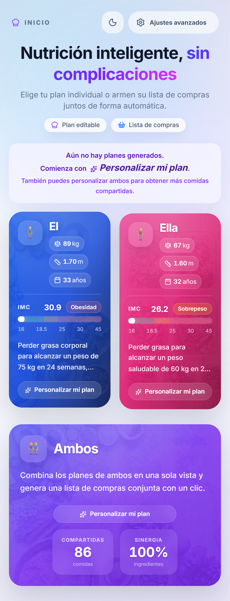
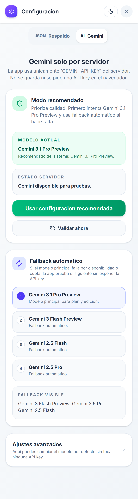
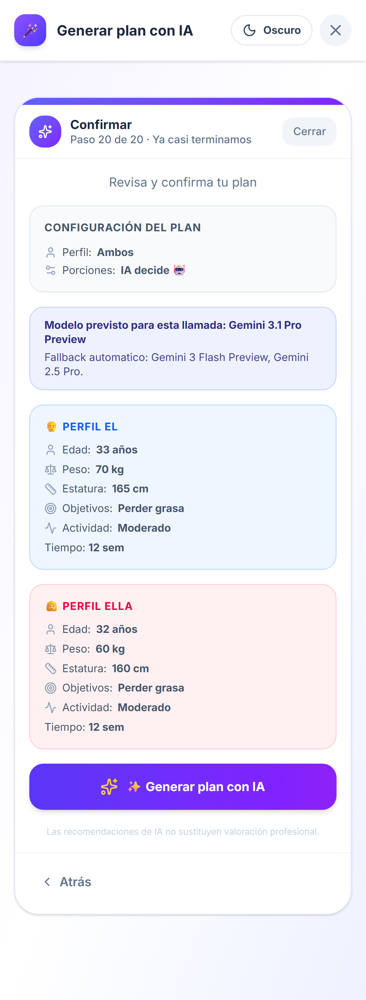
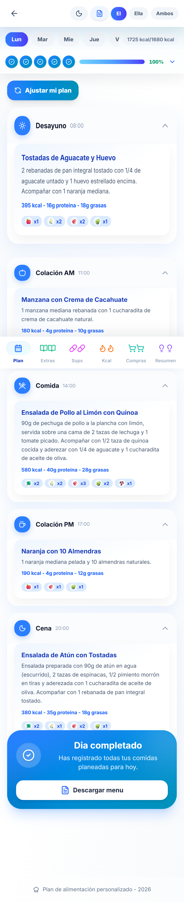
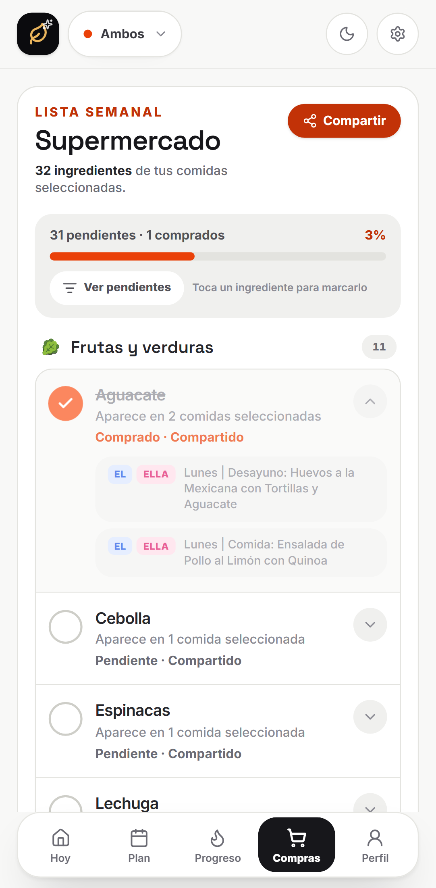
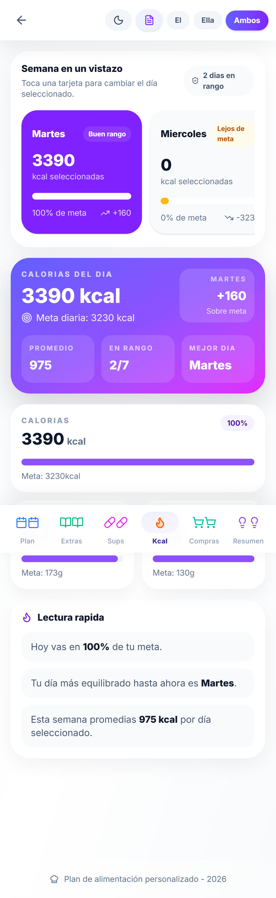
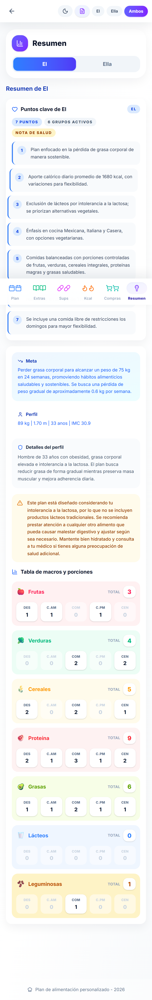

# Plan Nutricional

Aplicacion web en React + Vite para gestionar planes nutricionales personalizados para `El`, `Ella` o `Ambos`, con generacion por IA, edicion de comidas, seguimiento diario y validacion visual movil con Playwright.

## Estado actual

- Landing mobile-first con acceso a perfiles individuales y vista compartida.
- Cuestionario IA en varios pasos para generar o actualizar planes.
- Ajustes avanzados para Gemini, respaldo/restauracion JSON y reseteo local.
- Vista de plan con seleccion de comidas por momento, edicion de platillos y descarga de PDF.
- Vistas dedicadas de equivalencias, suplementos, calorias, compras y resumen.
- Persistencia local en `localStorage`.
- Suite E2E movil con capturas reales en `docs/screenshots/mobile`.

## Stack

- React 19
- TypeScript
- Vite
- Tailwind CSS 4
- Framer Motion
- jsPDF / jspdf-autotable
- Playwright

## Variables de entorno

La app usa Gemini solo desde el servidor.

Local (`.env.local`, no se versiona):

```bash
GEMINI_API_KEY=tu_api_key
GEMINI_MODEL=gemini-3.1-pro-preview
```

Para empezar rapido:

```bash
cp .env.example .env.local
```

En Vercel usa los mismos nombres de variables: `GEMINI_API_KEY` y `GEMINI_MODEL`.

## Scripts

```bash
npm install
npm run dev
npm run dev:vercel
npm run build
npm run preview
npm run test:e2e
```

`npm run test:e2e` compila la app, levanta `vite preview`, ejecuta la suite movil y actualiza las capturas usadas en esta documentacion.

`npm run dev:vercel` levanta la app con las rutas de `api/` activas para validar localmente `/api/gemini-status` y `/api/generate-plan`.

## Flujos cubiertos por pruebas moviles

- Landing y acceso a administracion.
- Configuracion de Gemini con selector de modelo por defecto y fallback.
- Cuestionario completo para `Ambos` con generacion simulada.
- Confirmacion previa mostrando el modelo previsto y confirmacion final mostrando el modelo usado.
- Seleccion de comidas en `Mi Plan`.
- Edicion de un platillo y descarga de PDF diario.
- Navegacion movil por `Equivalencias`, `Suplementos`, `Calorias`, `Compras` y `Resumen`.

## Capturas actuales

### Landing



### Configuracion



### Confirmacion del cuestionario IA



### Mi Plan



### Compras



### Calorias



### Resumen



## Estructura relevante

```text
api/                         Endpoints para Gemini en despliegue
docs/screenshots/mobile/     Capturas generadas por Playwright
src/components/views/        Landing, plan, compras, calorias, resumen, etc.
src/context/                 Estado global y navegacion
src/data/defaults/           Fixtures base de los perfiles
tests/e2e/                   Suite movil y helpers de seed/mocks
playwright.config.ts         Configuracion E2E
```

## Guia de uso

La guia operativa de la aplicacion esta en [GUIA_DE_USO.md](GUIA_DE_USO.md).
