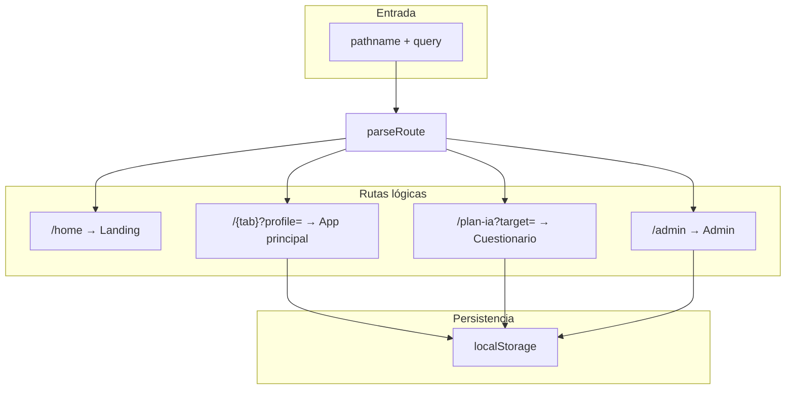

# Plan Nutricional

Aplicación web (SPA) para gestionar planes alimentarios para dos perfiles (`El`, `Ella`), una vista combinada (`Ambos`), seguimiento por día, listas de compra, equivalencias, suplementos, monitoreo calórico, exportación a PDF y generación o ajuste de planes mediante **Google Gemini** llamado **solo desde el backend** (Vercel Serverless / `vercel dev`).

En `package.json` el nombre del paquete es `plan-comidas-2026`; la interfaz y la documentación de uso siguen llamando al producto «Plan Nutricional».

---

## Resumen de comportamiento (vista de pájaro)

1. **Sin perfil activo**: se muestra la landing (`LandingView`). El usuario elige entrar como El, Ella, Ambos, abrir **Administración** o **Generar plan con IA**.
2. **Con perfil activo**: layout principal con `Header`, barra de pestañas (escritorio arriba / móvil abajo con `env(safe-area-inset-bottom)`), contenido según pestaña y pie de página.
3. **Cuestionario IA** y **Administración** no son rutas React Router: son **estados globales** que hacen que `App.tsx` devuelva un árbol distinto (pantalla completa) y sincronizan la URL con `history.pushState` / `replaceState` desde `DietContext`.
4. Los datos efectivos del plan por persona salen de **JSON embebidos por defecto** o de **`customData` en `localStorage`**, según `dataVersions.el` / `dataVersions.ella`.



---

## Stack y versiones relevantes

| Área | Tecnología |
|------|------------|
| UI | React 19, TypeScript, Vite |
| Estilo | Tailwind CSS 4 (PostCSS), `index.css` |
| Animación | Framer Motion |
| Iconos | lucide-react |
| PDF | jsPDF + jspdf-autotable |
| E2E | Playwright (`Pixel 7` / Chromium) |
| Unit | Node `tsx --test` (`tests/unit/*.test.ts`) |

Dependencias exactas: ver `package.json` y `package-lock.json`.

---

## Cómo se arranca en desarrollo

### `npm run dev` (solo frontend Vite)

- Arranca Vite en el **puerto 3000** (`vite.config.ts`).
- Configura un **proxy** para `'/api'` → `http://localhost:3001`.

**Implicación:** con solo `npm run dev`, las peticiones `fetch('/api/...')` esperan un servidor escuchando en el **3001**. Si no hay nada ahí, fallarán validación de Gemini y generación de planes.

### `npm run dev:vercel` (frontend + funciones serverless locales)

- Ejecuta `npx vercel dev`, que sirve la app y las rutas bajo `api/*.js` de forma integrada.
- Es la forma recomendada para probar **de punta a punta** `/api/gemini-status` y `/api/generate-plan` en local.

### `npm run build` y `npm run preview`

- `build` ejecuta `tsc && vite build`; salida en `dist/`.
- `preview` sirve el build estático; **no incluye** las funciones `api/` salvo que combines con otro proceso o despliegue.

---

## Variables de entorno

Solo el **servidor** debe tener la clave de Gemini (nunca se expone al bundle del cliente de forma intencionada).

Archivo local: **`.env.local`** (no versionado). Plantilla: **`.env.example`**.

| Variable | Rol |
|----------|-----|
| `GEMINI_API_KEY` | Clave de la API Google Generative Language |
| `GEMINI_MODEL` | Modelo por defecto en servidor si no se envía otro; debe alinearse con lo que acepta tu cuenta |

En Vercel, definir las mismas variables en el panel del proyecto.

El cliente guarda el **modelo elegido en UI** en `localStorage` bajo la clave `geminiModel` (`persistGeminiModel` en `src/utils/geminiModels.ts`). Al montar, se elimina almacenamiento heredado de clave en cliente (`clearLegacyGeminiApiKeyStorage`).

---

## API serverless (`api/`)

Despliegue: **Vercel** (`vercel.json`).

- **Rewrites**: todo lo que no sea `/api/*` va a `/` (SPA). `/api/*` se resuelve a las funciones.
- **Duración máxima** de funciones: **300 s**.
- **CORS** en `/api/*`: cabeceras amplias en `vercel.json`; además cada handler usa `applyCorsHeaders` y **`getTrustedRequestMeta`** (`api/_requestGuard.js`): solo se considera petición **confiable** si el `Origin` o `Referer` coincide con hosts permitidos (producción Vercel, `localhost:3000`, `127.0.0.1:3000`, `localhost:5173`, `127.0.0.1:5173`, `localhost:3001`, variables `APP_URL` / `SITE_URL`, etc.). Origen no listado → **403** en generación y estado de Gemini.

### `POST /api/gemini-status`

- Lista modelos disponibles vía `GET https://generativelanguage.googleapis.com/v1beta/models` y filtra los que soportan `generateContent` y el criterio de texto del proyecto (`_geminiModels.js`).
- Opcionalmente, con `checkGeneration: true`, hace una llamada mínima a `:generateContent` para comprobar que el modelo responde.
- **Rate limit**: cubo `gemini-status`, ventana **60 s**, **20** peticiones por IP (cabeceras `X-RateLimit-Remaining`, `Retry-After` si 429).

El cliente (`src/services/geminiStatusService.ts`) hace `POST` con JSON `{ preferredModel?, checkGeneration? }`. El contexto (`DietContext`) llama a `refreshGeminiAvailability` al cambiar `geminiModel` y **throttle** adicional de **60 s** entre comprobaciones no forzadas en segundo plano.

### `POST /api/generate-plan`

- Cuerpo JSON: payload del cuestionario, revisión de plan, catálogos que el cliente adjunta (`mealsCatalog`, `supplementsCatalog` se inyectan en `requestAiResponse` dentro de `DietContext`), `preferredModel`, modos de solicitud, etc.
- Implementación grande en `api/generate-plan.js`: construcción de prompts, validación de esquema, protocolos clínicos heurísticos según texto de diagnóstico (`CLINICAL_PROTOCOLS`), reintentos entre modelos ordenados, sanitización de logs de depuración (enmascaramiento de API keys, recorte de PDF en base64 en trazas), y respuesta JSON con `elData` / `ellaData` y `modelUsed` (puede listar varios modelos separados por coma si hubo encadenamiento).
- **Rate limit**: cubo `generate-plan`, ventana **60 s**, **8** peticiones por IP.

---

## Frontend: montaje y capas

- `src/main.tsx`: `StrictMode`, `AppErrorBoundary`, `DietProvider`, `App`.
- `src/App.tsx`:
  - **Cuestionario abierto** (`showQuestionnaire`): pantalla dedicada con cabecera propia (tema claro/oscuro, cerrar), `NutritionQuestionnaire` en `Suspense`.
  - **Admin abierto** (`showAdmin`): `AdminLayout` lazy.
  - **Sin `perfilActivo`**: `LandingView`.
  - **App principal**: `Header`, `DailyProgress` solo si pestaña `plan`, tabs desktop/móvil, vistas lazy según `activeTab`, `footer`.
  - Efecto: si hay perfil pero `tab` vacío, fuerza `plan`.
  - Atributo `data-profile` en el contenedor raíz para estilos/tests.

---

## Estado global: `DietContext` (`src/context/DietContext.tsx`)

### Rutas y sincronización con el historial

- `parseRoute()` lee `window.location.pathname` y `search`:
  - `''`, `'home'` → vista home (landing).
  - `'admin'` → admin.
  - `'plan-ia'` → cuestionario; query `target` → `el` | `ella` | `ambos` (por defecto `ambos` si falta o es inválido).
  - Rutas de app: `miplan`, `equivalencias`, `calorias`, `compras`, `resumen`, `suplementos` + obligatorio `?profile=el|ella|ambos`. También se acepta alias `plan` → misma pestaña que `miplan`.
- `buildRoutePath()` genera la URL a partir del estado. En el primer render usa **`replaceState`** si la URL no coincide; después **`pushState`** cuando cambia el estado.
- Listener `popstate` reaplica estado (volver atrás/adelante restaura perfil, pestaña, admin o cuestionario).

### Fuentes de datos de perfiles

- **Origen canónico embebido**: `src/data.ts` importa `src/data/defaults/perfil-el.json` y `perfil-ella.json`, mapea iconos de equivalencias con `iconsMap`, enriquece planes con `enrichPlanWithNutrition`.
- **Modo custom por persona**: si `dataVersions.el === 'custom'`, el plan y metadatos se arman desde `customData.el` (claves `planEL`, `perfilEL`, `equivalenciasEL`, `suplementosEL`); análogo para `ella` con sufijo `ELLA`.
- **Normalización defensiva**: al leer `customData`, funciones `normalizePlanData`, `normalizeProfileData`, `normalizeEquivalencesData`, `normalizeSupplementsData` fusionan con el fallback del perfil original para claves faltantes o tipos rotos; texto pasado por `repairBrokenText` donde aplica.

### Selección de comidas y progreso

- Claves en `selecciones` (`localStorage` `seleccionesDieta`): `` `${perfilId}-${dia}-${momentoKey}-${nombreComida}` `` con `perfilId` ∈ `el` | `ella`.
- `toggleSeleccion`: solo **una opción marcada por momento** por perfil (al elegir una, se limpian las demás del mismo día/momento/perfil).
- **Progreso del día**:
  - Perfil único: un momento se considera hecho si alguna comida de ese momento tiene selección.
  - `ambos`: un momento cuenta como hecho solo si **ambos** perfiles tienen selección en ese momento.
  - Porcentaje `progresoDia` y contadores derivados en memoria.
- Tras IA que cambia celdas del plan, `syncSelectionsForUpdatedSlots` intenta **preservar** la selección si el nombre de plato sigue existiendo; si no, cae en la primera opción del slot.
- Efecto al cambiar `perfilesData`: purga claves de `selecciones` que ya no corresponden a comidas reales (`isSelectionKeyValid`).

### Edición y restauración de recetas

- `editMealRecipe` / `restoreMealRecipe` delegan en `utils/mealEditing.ts`, actualizan `customData`, marcan `dataVersions[perfil] = 'custom'`, y renombran claves de `selecciones` si cambió el nombre del plato.

### Generación con IA (cuestionario)

1. `handleGenerateWithAi` limpia errores, pone `generationLoading`.
2. `requestAiResponse` hace `POST /api/generate-plan` con el payload más `preferredModel: geminiModel` y catálogos.
3. Manejo de respuesta: distingue HTML (p. ej. error de proxy), cuerpo vacío, JSON de error con `aiDebugLog`, red caída → errores tipados con `createClientAiError` / `aiDiagnostics`.
4. Exige al menos uno de `elData` o `ellaData` en JSON OK.
5. Cada bloque pasa por `validateAndNormalizeDirectAiData` (`aiService.ts`).
6. Actualiza `lastGeneratedData`, `lastQuestionnaireContext` (sin volcar PDF completo: solo nombre y `mimeType` en el clon guardado), `customData`, `dataVersions` solo para lados realmente devueltos.
7. Cierra cuestionario y `notify` con el modelo usado (etiqueta legible vía `getGeminiModelLabel`).

### Revisión de plan con IA

- `handleRevisePlanWithAi`: mismo transporte `requestAiResponse`.
- Si el servidor devuelve `responseMode === 'adjust'` o un objeto con `planPatch` / `profilePatch`, se aplica un **parche** sobre el bucket crudo actual (`planAiUtils.ts`) en lugar de reemplazar todo el JSON.
- Si no, se trata como respuesta completa normalizada como en la generación inicial.
- Sincroniza selecciones según slots afectados o todo el plan si aplica.

### Otros efectos globales

- Tema oscuro: clase `dark` en `document.documentElement` y `colorScheme`.
- `perfilActivo` también se escribe en `localStorage` `perfilActivo` vía `safeStorage` (además del estado React inicializado por ruta).
- Scroll: al cambiar día o pestaña, scroll al inicio; al completar momentos en ciertas condiciones, auto-scroll al siguiente momento (`pendingAutoScrollMomento` + `scrollToMomento`).
- Al cambiar pestaña / día / perfil: colapsa progreso expandido y mapas de colapso/edición de momentos.
- Errores de almacenamiento: evento personalizado `APP_STORAGE_ERROR_EVENT`; el provider muestra alerta con deduplicación ~8 s.

---

## Importación y exportación JSON (admin / respaldo)

- `dataManager.ts`: `parseJsonToData` / `parseObjectToData` valida prefijo `EL` o `ELLA`, normaliza días (`normalizeDayName`), exige plan completo por cada día y momento del perfil, rehidrata comidas con `rehydratePlanRecord` (`mealsDB`), hidrata suplementos contra catálogo (`hydrateSupplementFromReference`), repara artefactos de texto (`repairTextArtifactsDeep`).
- `downloadJsonFile`: descarga blob `application/json`.

---

## Utilidades de dominio destacadas

- `utils/nutrition.ts` + datos en `mealsDB`: enriquecimiento de macros en planes.
- `utils/nutritionValidation.ts`: validación coherente con catálogos.
- `services/pdfService.ts`: PDF por perfil y día; colores distintos para los dos perfiles en exportes combinados.
- `utils/planAiUtils.ts`: snapshots serializables, parches de revisión, resúmenes.
- `utils/aiDiagnostics.ts`: logs estructurados para UI y depuración.

---

## Componentes por carpeta (orientación)

| Ruta | Rol |
|------|-----|
| `src/components/views/` | `LandingView`, `Header`, `DailyProgress`, `PlanView`, `EquivalenciasView`, `SupplementsView`, `CalorieMonitoringView`, `ShoppingView`, `SummaryView`, `AdminLayout` |
| `src/components/` | `NutritionQuestionnaire`, `MealSelector`, `MealEditSheet`, `PlanAiRefreshSheet`, `AdminPanel`, `EquivalenciasCard`, `AppErrorBoundary` |
| `src/data/` | Defaults JSON, DB de comidas/suplementos, scripts de mantenimiento (`update_db.cjs`) |

La guía operativa para personas usuarias sigue en [GUIA_DE_USO.md](GUIA_DE_USO.md).

---

## Persistencia en `localStorage` (claves usadas por la app)

| Clave | Contenido (resumido) |
|-------|----------------------|
| `darkMode` | boolean |
| `diaActivo` | día de la semana canónico en español |
| `seleccionesDieta` | mapa `clave → true` de comidas marcadas |
| `comprasCheck` | ítems de lista tachados |
| `dataVersions` | `{ el, ella }` ∈ `original` \| `custom` |
| `customData` | buckets `el` / `ella` con plan, perfil, equivalencias, suplementos |
| `geminiModel` | id del modelo elegido en UI |
| `lastQuestionnaireContext` | último payload de cuestionario (PDF recortado a metadatos) |
| `questionnaireTargetProfile` | `el` \| `ella` \| `ambos` |
| `questionnaireStepIdx` | índice de paso |
| `questionnaireEl` / `questionnaireElla` | borradores del formulario |
| `perfilActivo` | perfil activo (duplicado explícito para otras lecturas) |

`src/utils/appStorage.ts` lista un subconjunto usado por **reset controlado** (`clearAppStorage`); el cuestionario y contexto IA usan claves adicionales arriba.

---

## Scripts npm

| Script | Qué hace |
|--------|----------|
| `npm run dev` | Vite en **:3000**, proxy `/api` → **:3001** |
| `npm run dev:vercel` | `vercel dev` (app + `api/`) |
| `npm run build` | Typecheck + build Vite → `dist/` |
| `npm run preview` | Sirve `dist` (puerto por defecto de Vite preview; Playwright fuerza **4173**) |
| `npm run test:unit` | Tests unitarios con `tsx` |
| `npm run test:e2e` | `npm run build` + `playwright test` (proyecto móvil Chromium) |

Playwright (`playwright.config.ts`): `baseURL` **http://127.0.0.1:4173**, `webServer` arranca `npm run preview -- --host 127.0.0.1 --port 4173`, reutiliza servidor si ya existe.

Los E2E **interceptan** `/api/generate-plan` y `/api/gemini-status` (`tests/e2e/helpers/app-fixtures.ts`) y devuelven fixtures basados en `src/data/defaults/*.json`, de modo que **no consumen cuota real de Gemini**.

Al ejecutar los E2E, `saveDocScreenshot` crea (si no existe) **`docs/screenshots/mobile/`** y guarda PNG de documentación (por ejemplo `landing-mobile.png`). Si el directorio no está en el repo todavía, aparecerá tras la primera corrida de `test:e2e`.

### Flujos cubiertos por E2E (alto nivel)

- Landing, administración (pestaña ajustes Gemini), cuestionario completo para Ambos con generación **simulada**, confirmación con texto de modelo previsto y alerta con modelo usado.
- Plan: selección de opciones por día/momento, edición de plato, descarga PDF.
- Navegación móvil por Equivalencias, Suplementos, Calorías, Compras, Resumen.

---

## Estructura de carpetas (referencia)

```text
api/                    Handlers Vercel: generate-plan, gemini-status, guardas CORS/rate limit
src/
  components/           UI compuesta y hojas modales
  components/views/     Vistas de pantalla completa o pestañas
  context/              DietContext (estado + rutas lógicas + IA)
  data/                 JSON por defecto, catálogos, perfiles TS reexportados
  hooks/                useLocalStorage
  services/             Cliente IA estado, PDF, aiService (normalización respuesta)
  utils/                Nutrición, macros, almacenamiento seguro, texto, temas, etc.
tests/
  e2e/                  Espec móvil + helpers de mock
  unit/                 Pruebas de nutrición y handler de plan
dist/                   Salida de build (no versionar si tu flujo lo ignora)
vercel.json             Rewrites, headers API, maxDuration functions
```

---

## Despliegue en Vercel

1. Conectar el repositorio o subir proyecto.
2. **Build command** `npm run build`, **output** `dist` (coherente con `vercel.json`).
3. Variables `GEMINI_API_KEY` y `GEMINI_MODEL`.
4. Opcional: `APP_URL` o `SITE_URL` si el dominio custom no coincide con los hosts inferidos de Vercel (afecta validación de origen en API).

---

## Licencia y privacidad (recordatorio breve)

Los planes y respuestas del cuestionario viven **en el navegador** salvo que exportes JSON o generes PDF. La IA procesa el payload que envías al servidor según la política de Google y tu configuración de proyecto; revisa límites y retención en la consola de Google Cloud / AI Studio según tu caso.
